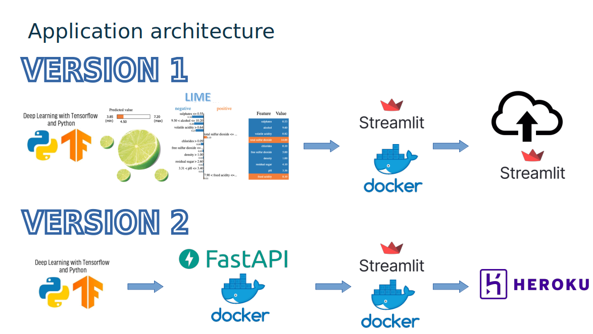

# Project_Wine_Quality
Our application is avaible here https://project-wine-quality.streamlit.app/

# Project_Wine_Quality
-----------------------------------------------------------------------------------------------------------------------------

*This project is a part of my Jedha Data Fullstack program certification*

-----------------------------------------------------------------------------------------------------------------------------

Our application is avaible here https://project-wine-quality.streamlit.app/

## Introduction

Recently, I’ve acquired a taste for wines, although I don’t really know what makes a good wine. Therefore, I decided to apply some machine learning models to figure out what makes a good quality wine!

For this project, we used Kaggle's Red and White Wine Quality dataset to build various classification models to predict whether a particular wine is "good quality" or not. Each wine in this dataset is given a "quality" score ranging from 0 to 10. For this project, we converted the output into a three-class output where each wine is classified as either "low quality" (score 0-3), "medium quality" (score 3-7), or "high quality" (score 7-10). The quality of a wine is determined by 11 input variables:

    1. Fixed acidity
    2. Volatile acidity
    3. Citric acid
    4. Residual sugar
    5. Chlorides
    6. Free sulfur dioxide
    7. Total sulfur dioxide
    8. Density
    9. pH
    10. Sulfates
    11. Alcohol

## Objectives

The objectives of this project are as follows

    1. To experiment with different classification methods to see which yields the highest accuracy
    2. To analyse with Lime methode which features are the most indicative of a good quality wine for each input data

With that said, here we go!

## Video presetation

https://share.vidyard.com/watch/NvdZTJYniR8iiGVfak13km?/